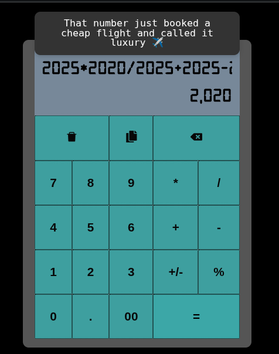

# Dissculator 😤

> _Math with an attitude._

Dissculator is a savage, sarcastic, slightly rude calculator built to do math... and judge you for it.  
It’s not just a calculator — it’s a personality.

---

## 🔥 Features

- ✅ Basic calculator functions (add, subtract, multiply, divide)
- 🧠 Smart fallback responses based on user input
- 😏 Over 50+ sarcastic voice lines and roasts
- 🎭 Personality modes (chill, savage, chaotic — coming soon)
- ⚡ Fast, responsive, no lag
- 🕹️ Built for fun, made for flex

---

## 🖼️ Preview



---

## 🚀 Try It Out Live

👉 [https://dissculator.vercel.app](https://dissculator.vercel.app)

---

## 🛠️ Tech Stack

- **React** (with Vite or CRA)
- **TypeScript** (optional, depending on setup)
- **Vercel** – for hosting

---

## 📦 Installation

```bash
git clone https://github.com/divonacci/dissculator.git
cd dissculator
npm install
npm run dev
```
